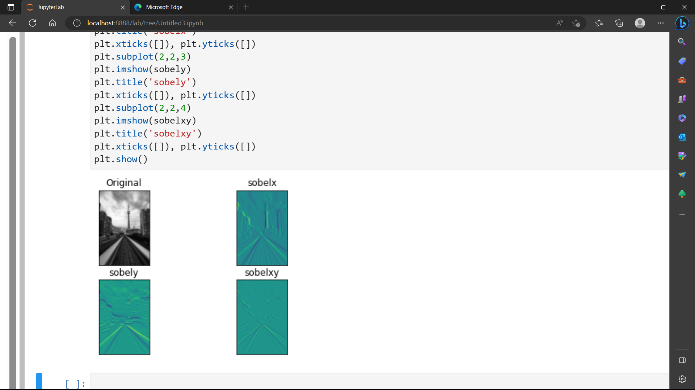
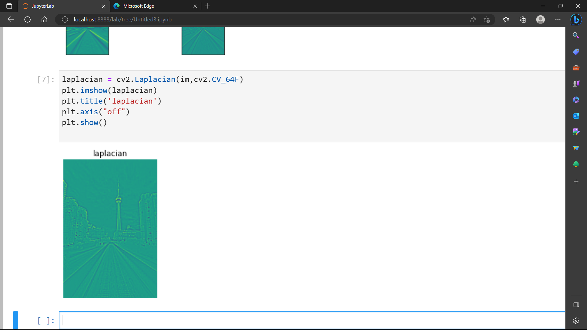

# Edge-Detection
## Aim:
To perform edge detection using Sobel, Laplacian, and Canny edge detectors.

## Software Required:
Anaconda - Python 3.7

## Algorithm:
### Step1:
Import the necessary modules.

### Step2:
Perform edge detection on a image.

-Sobel
-Laplacian
-Canny

### Step3:
Display the original images with edge detected images.

 
## Program:

``` Python
# Import the packages
import cv2
import numpy as py
import matplotlib.pyplot as plt

# Load the image, Convert to grayscale and remove noise
img=cv2.imread('dip.jpg')
cv2.imshow('dhanush',img)
im=cv2.cvtColor(img,cv2.COLOR_BGR2GRAY)
im=cv2.GaussianBlur(im,(3,3),0)
cv2.imshow('dhanush',im)
cv2.waitKey(0)
cv2.destroyAllWindows()


# SOBEL EDGE DETECTOR
sobelx = cv2.Sobel(im,cv2.CV_64F,1,0,ksize=5)
sobely = cv2.Sobel(im,cv2.CV_64F,0,1,ksize=5)
sobelxy = cv2.Sobel(im,cv2.CV_64F,1,1,ksize=5)
plt.figure(1)
plt.subplot(2,2,1)
plt.imshow(im,cmap = 'gray')
plt.title('Original'), plt.xticks([]), plt.yticks([])
plt.subplot(2,2,2)
plt.imshow(sobelx)
plt.title('sobelx')
plt.xticks([]), plt.yticks([])
plt.subplot(2,2,3)
plt.imshow(sobely)
plt.title('sobely')
plt.xticks([]), plt.yticks([])
plt.subplot(2,2,4)
plt.imshow(sobelxy)
plt.title('sobelxy')
plt.xticks([]), plt.yticks([])
plt.show()


# LAPLACIAN EDGE DETECTOR
laplacian = cv2.Laplacian(im,cv2.CV_64F)
plt.imshow(laplacian)
plt.title('laplacian')
plt.axis("off")
plt.show()


# CANNY EDGE DETECTOR
canny_edges = cv2.Canny(im, 120, 150)
plt.imshow(canny_edges)
plt.title('canny_edges')
plt.axis("off")
plt.show()


```
## Output:
### SOBEL EDGE DETECTOR



### LAPLACIAN EDGE DETECTOR



### CANNY EDGE DETECTOR


## Result:
Thus the edges are detected using Sobel, Laplacian, and Canny edge detectors.
